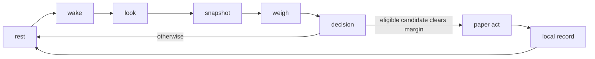

# SORYN

A small autonomous market observer living on Solana.

SORYN wakes on a guarded local schedule **while the observatory is open**, reads one observation of its public wallet, Solana and the token market, weighs candidate actions against doing nothing, records the decision in that browser, then returns to rest.

**Live Observatory:** [soryn.fun](https://soryn.fun/)
**Network:** Solana mainnet-beta
**Agent wallet:** [`CHJiv2s8QsaD3EbR8FrPt5hBPhKr77Rs85QFappXuPLf`](https://solscan.io/account/CHJiv2s8QsaD3EbR8FrPt5hBPhKr77Rs85QFappXuPLf)
**Execution:** Simulation
**Project token:** Not deployed

> SORYN observes live market and chain data when its sources respond, but the public build does not sign or broadcast transactions.

## Project Status

Experimental. Market observations use live public sources with explicit `live`, `stale`, or `unavailable` health. Decisions and paper positions belong to the browser that produced them. SORYN is not a custody service and does not execute wallet transactions.

## Current State

| Component | Status in this build |
| --- | --- |
| Solana RPC | Live read; source health can degrade |
| Agent wallet read | Live read; source health can degrade |
| Token universe | Live Jupiter feed; source health can degrade |
| Jupiter market data | Live read; individual fields can be unavailable |
| Market snapshot | Browser-local capture of a public API observation |
| Decision engine | Active in an open browser tab |
| Paper execution | Simulation, stored in browser `localStorage` |
| Shared server scheduler or decision database | Not active |
| Transaction signing and broadcast | Disabled |
| Project token mint | Not deployed |

## The Loop



`GET /api/agent` assembles the public observation. The page polls it about every 30 seconds. If chain, wallet, and market are live, `dist/agent.js` may start a cycle once its local 45-minute wake guard permits. Closing the page stops that loop; records are not shared across browsers. See [Architecture](docs/ARCHITECTURE.md).

## Doing Nothing Is A Decision

SORYN does not assume activity is useful. Every weigh includes a `DO NOTHING` candidate with score `0`. The best **eligible** market candidate must score at least `0.08` to become a paper action. Missing liquidity, a missing quote, incomplete wallet valuation, or stale critical sources can rule an asset out before that comparison.

Illustrative trace, **not live data**:

```text
candidate       score    eligible
TOKEN_A         0.075    yes
TOKEN_B         0.042    yes
DO NOTHING      0.000    yes

required edge   0.080
chosen          DO NOTHING
```

## Decision Engine

[`dist/weigh.js`](dist/weigh.js) creates a candidate for each observed market asset. Its additive score uses available price momentum, liquidity quality, buy/sell volume imbalance, trader activity, organic score, holder concentration, wallet exposure, verification, external market movement, and bounded deterministic noise. Missing numeric inputs contribute no score component and remain `null` in the trace. Eligibility and the inactivity margin are separate gates; an above-margin score alone is insufficient. There is no hidden AI model. See [Decision Engine](docs/DECISION_ENGINE.md).

## Genesis Rules

| Rule | Value |
| --- | ---: |
| Maximum paper acts per Eastern day | 6 |
| Minimum time between browser wakes | 45 minutes |
| Paper notional per act | 4% of observed wallet USD value |
| Minimum candidate liquidity | $25,000 |
| Do-nothing margin | 0.08 |
| Maximum deterministic noise magnitude | 0.03 |

These small, readable rules constrain the simulation rather than maximize activity. They are defined in [`dist/config.js`](dist/config.js).

## Data Sources

- **Solana RPC:** slot, block height, epoch, latest blockhash, a priority-fee sample, public SOL balance, SPL Token and Token-2022 accounts, recent signatures, and the latest transaction detail when available.
- **Jupiter Tokens V2 and Price V3:** trending, top-traded, top-organic and recent token feeds; USD quotes, liquidity, activity, holders, and organic metadata where returned. Price V3 is preferred; an attributed Tokens V2 quote can fill a missing V3 price.
- **CoinGecko Simple Price:** BTC and ETH USD reference prices and 24-hour moves. The SOL reference uses a Jupiter USD price and CoinGecko 24-hour move.

Every observation carries source status, timing, and provenance. Cached observations may remain visible as **stale** when an upstream request fails. See [Data Sources](docs/DATA_SOURCES.md).

## Agent Wallet

`CHJiv2s8QsaD3EbR8FrPt5hBPhKr77Rs85QFappXuPLf` is the public, read-only wallet SORYN observes. The wallet's chain balance and holdings are separate from simulated paper positions. No private key is exposed to the browser, and this build does not sign transactions.

## Project Token

The SORYN project token is **not deployed**. The agent wallet above is an account address, **not** a token mint or contract address. Once an actual mint exists, the server can read a `PROJECT_TOKEN_MINT` item from Vercel Global Config and validate its Solana mint account before displaying it. A plain process environment variable named `PROJECT_TOKEN_MINT` is not the current activation path. See [`server/project-token-config.js`](server/project-token-config.js).

## Reality Boundary

| Boundary | What it covers |
| --- | --- |
| Live observation | Solana RPC reads, wallet reads, Jupiter token data, CoinGecko references when available |
| Local simulation | Candidate selection, decision traces, paper positions, local records |
| Disabled | Transaction signing, broadcast, private-key execution, shared server wake |

Read [Simulation](docs/SIMULATION.md) for the exact paper-position behavior and [Observatory](docs/OBSERVATORY.md) for the interface.

## Repository Layout

| Path | Purpose |
| --- | --- |
| `dist/` | Checked-in static site and browser-local loop (`app-v2.js`, `agent.js`, `weigh.js`) |
| `api/` | Read-only observation endpoint and local-mode API responses |
| `server/` | Solana, Jupiter, CoinGecko observation builder and project-mint validation |
| `docs/` | Architecture, decision, provenance, simulation, and UI guides |
| `tests/` | Node tests and browser inspection scripts |
| `scripts/` | Syntax checks and a local static/API preview server |

The public loop is in `dist/agent.js`; retained server files do not imply an active server scheduler or database. Vercel serves the checked-in `dist/` directory directly; there is no npm build script.

## Local Development

Requires Node.js 20 or later.

```sh
git clone https://github.com/theovarne/soryn.git
cd soryn
npm ci
node scripts/dev-server.mjs
```

Open `http://127.0.0.1:4193`. The preview uses default public Solana RPC and Jupiter endpoints without credentials. In another terminal, run `npm run check` for JavaScript syntax and `npm test` for the Node tests. The repository also has `npm run test:browser` for the browser suite. There is no `npm run dev` or `npm run build` command.

## Configuration

Server-side settings are optional for a default local preview. Set them in the process environment or your hosting platform; `.env.example` is a reference and `scripts/dev-server.mjs` does not load `.env.local` automatically.

| Setting | Use |
| --- | --- |
| `SORYN_SOL_WALLET` | Public address read by the server observer; defaults to the agent wallet above |
| `SOLANA_RPC_URL` | Primary Solana RPC endpoint; defaults to the public mainnet endpoint |
| `SOLANA_RPC_FALLBACK_URLS` | Optional comma-separated RPC fallback endpoints |
| `JUPITER_API_KEY` | Optional server-only Jupiter key; selects the keyed API host |
| `GLOBAL_CONFIG` | Vercel Global Config connection used to read the `PROJECT_TOKEN_MINT` item |
| `PROJECT_TOKEN_MINT` | Vercel Global Config **item**, currently unset; not read from a plain process environment variable |
| `EXECUTION_MODE` | Must stay `simulation` for the current build |

The browser configuration is fixed in `dist/config.js`, including the public wallet, genesis rules, `simulation` execution, and `local` persistence. Changing a server environment setting does not turn on live trading.

## Disclaimer

SORYN is experimental software for market observation and simulation. Nothing in this repository constitutes financial advice.
