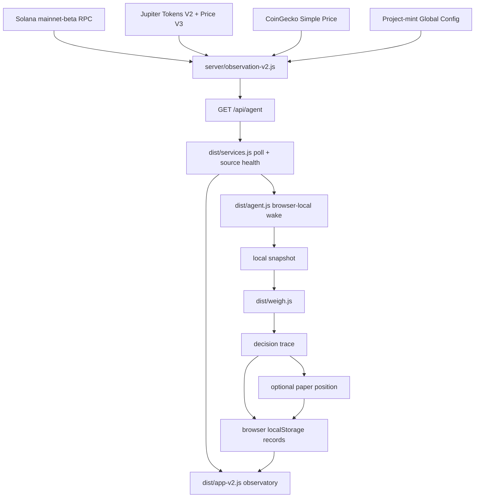

# Architecture

SORYN has a read-only observation path and a browser-local simulation path. The website is the observatory for both. Vercel serves the checked-in `dist/` site and runs `api/agent.js`; an open page owns the wake cycle and its records.

## Read path

`server/observation-v2.js` calls Solana JSON-RPC for chain state, the public wallet, token accounts, signatures, and latest transaction detail. It combines Jupiter token feeds and price quotes with CoinGecko reference moves. The returned JSON includes `chain`, `wallet`, `market`, `externalSignals`, `lastTransaction`, `projectTokenConfig`, and per-source status, health, and provenance. Upstream failures produce missing values or attributed stale values, not synthetic balances, prices, or signatures.

`api/agent.js` exposes the observer through GET only. It coalesces concurrent requests and keeps a successful result in process memory for up to 10 seconds; the response also sets a five-second shared-cache lifetime. These short caches reduce duplicate upstream reads. A response is one assembled observation, not an atomic Solana transaction or a guarantee that every provider reported at the same instant.

`dist/services.js` requests that API about every 30 seconds. If the current market request fails, it can show the browser's last usable market observation with `stale` status. It can also retain prior BTC, ETH, and SOL reference fields when new values are missing. If the whole API request fails, it returns the saved observation marked stale; with no saved observation, the fields are unavailable. The UI shows source health, while the decision loop will not run on a stale observation.

## Browser-local cycle

On each new observation, `dist/app-v2.js` calls `ingestObservation` in `dist/agent.js`. If chain, wallet, and market are live, a cycle is due, and no local cycle is active, the browser records `wake → look → snapshot → weigh → decision → optional simulated act → rest`. `dist/weigh.js` scores market assets and includes a formal do-nothing baseline. At most one paper position can be opened per cycle.

The guard uses the last **wake** time, with a 45-minute minimum. The code caps simulated act records at six per America/New_York day. A localStorage lock coordinates tabs in the same browser profile. This is a local UI runtime: closing the page stops polling and waking. Another browser has its own history and can reach a different local state.

Snapshots, decisions, cycles, records, and paper positions are stored in browser `localStorage` with bounded history. The current page keeps up to two full snapshots, 40 compact observation-history entries, 100 cycles, 100 paper positions, and 1,000 records. This is not shared server persistence. The `/api/agent/state`, `/records`, `/paper`, `/cycles`, and `/api/snapshots/*` routes return local-mode metadata or empty shared collections; `/api/agent/wake` returns 410 (`server wake disabled`).

## Execution boundary

An `act` is a local paper-position entry with a recorded price, side, quantity, and 4% observed-wallet-value notional. It does not alter the observed wallet. There is no transaction signer, private-key read, swap submission, broadcast, or fabricated transaction signature in the public path. See [Simulation](SIMULATION.md).

## Code map

| Path | Current role |
| --- | --- |
| `dist/config.js` | Public wallet, genesis limits, refresh settings, simulation mode |
| `server/settings.js` | Server-side wallet, RPC, and optional Jupiter key settings |
| `server/observation-v2.js` | Solana, Jupiter, and CoinGecko observation builder |
| `server/project-token-config.js` | Optional Global Config mint read and account validation |
| `api/agent.js` | Public read-only observation endpoint |
| `dist/services.js` | Browser poll and stale fallback |
| `dist/agent.js`, `dist/weigh.js` | Local loop, records, scoring, and paper positions |
| `dist/app-v2.js` | Home and five observatory views |

Other retained `server/` files do not constitute an active production scheduler or database-backed agent. The active runtime is the browser-local path described above.
